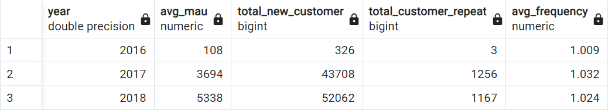
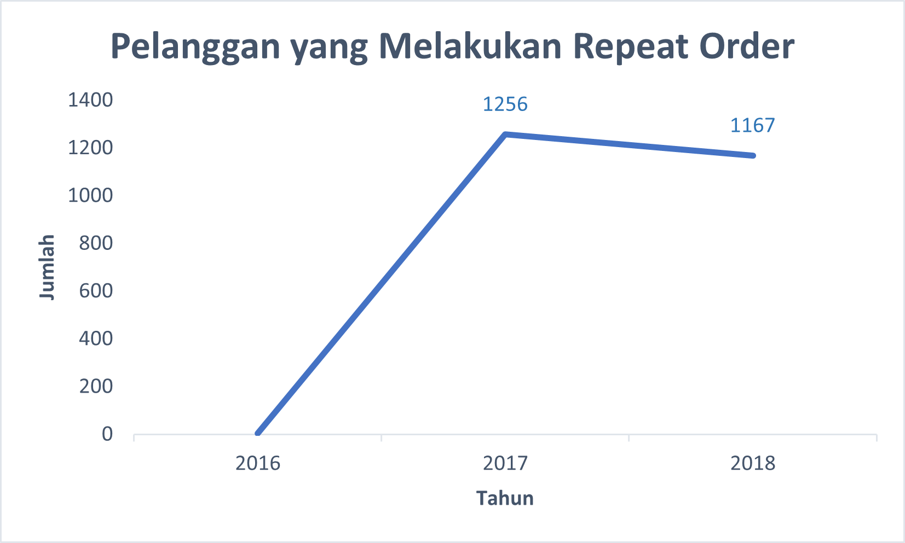
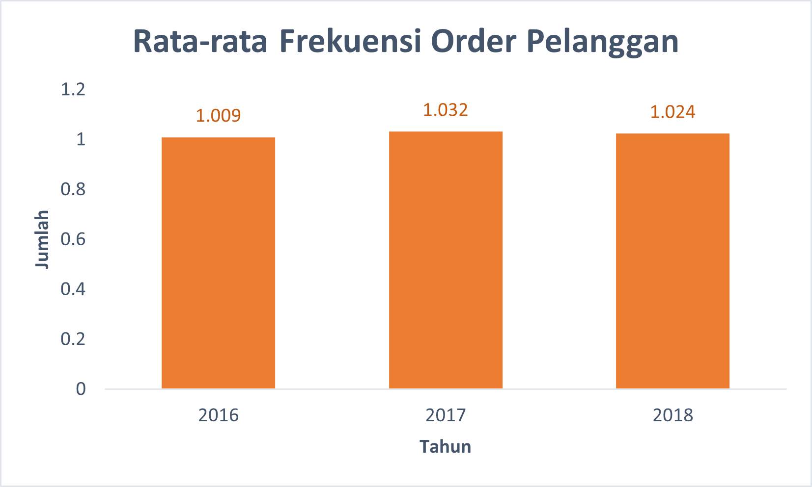

# **E-Commerce Business Performance with SQL**
<br>

**Tool** : PostgreSQL <br> 
**Visualization** : Microsoft Excel <br>
**Dataset** : Rakamin Academy
<br>
<br>

---

## 📂 **STAGE 0: Problem Statement**

### **Background Story**
비즈니스 성과를 측정하는 것은 기업에게 매우 중요합니다. 이는 다양한 비즈니스 프로세스의 성공 또는 실패를 모니터링하고 평가하는 데 도움이 됩니다. 비즈니스 성과 측정은 여러 비즈니스 지표를 고려하여 수행할 수 있습니다. 본 프로젝트에서는 3년간의 과거 데이터를 기반으로 고객 성장, 제품 품질, 결제 유형 등 비즈니스 지표를 활용하여 전자상거래 기업의 비즈니스 성과 분석을 수행합니다.

### **Objective**
1. **연간 고객 활동 증가** 
2. **연간 제품 카테고리 품질** 
3. **연간 결제 방식 사용**
<br>
<br>

---

## 📂 **STAGE 0: Data Preparation**
사용된 데이터셋은 브라질의 한 전자상거래 업체의 데이터셋으로 2016년부터 2018년까지 총 99,441건의 주문정보를 담고 있습니다. 
주문상태, 위치, 상품상세정보, 결제유형, 리뷰 등의 정보를 담고 있습니다.


### **Create Database and ERD**
1. pgAdmin 내부에 데이터베이스를 생성하고 `CREATE TABLE` 문을 사용하여 테이블을 생성
2. CSV 데이터를 데이터베이스로 가져오기 
3. `ALTER TABLE` 문을 사용하여 기본 키 또는 외래 키를 결정
4. ERD(엔티티 관계 다이어그램) 생성 및 내보내기 <br>

<details>
  <summary>Click untuk melihat Queries</summary>
  
  ```sql
-- 1) Create > Database.. dengan nama ecommerce_miniproject

-- 2) Data를 확인 후 CREATE TABLE 문을 사용하여 테이블을 생성
CREATE TABLE customers_dataset (
	customer_id varchar,
	customer_unique_id varchar,
	customer_zip_code_prefix varchar,
	customer_city varchar,
	customer_state varchar
);

CREATE TABLE sellers_dataset (
	seller_id varchar,
	seller_zip_code_prefix varchar,
	seller_city varchar,
	seller_state varchar
);

CREATE TABLE geolocation_dataset (
	geolocation_zip_code_prefix varchar,
	geolocation_lat decimal,
	geolocation_lng decimal,
	geolocation_city varchar,
	geolocation_state varchar
);

CREATE TABLE product_dataset (
	product_id varchar,
	product_category_name varchar,
	product_name_lenght int,
	product_description_lenght int,
	product_photos_qty int,
	product_weight_g decimal,
	product_length_cm decimal,
	product_height_cm decimal,
	product_width_cm decimal
);

CREATE TABLE orders_dataset (
	order_id varchar,
	customer_id varchar,
	order_status varchar,
	order_purchase_timestamp timestamp,
	order_approved_at timestamp,
	order_delivered_carrier_date timestamp,
	order_delivered_customer_date timestamp,
	order_estimated_delivery_date timestamp
);

CREATE TABLE order_items_dataset (
	order_id varchar,
	order_item_id int,
	product_id varchar,
	seller_id varchar,
	shipping_limit_date timestamp,
	price decimal,
	fright_value decimal
);

CREATE TABLE order_payments_dataset (
	order_id varchar,
	payment_sequential int,
	payment_type varchar,
	payment_installments int,
	payment_value decimal
);

CREATE TABLE order_reviews_dataset (
	review_id varchar,
	order_id varchar,
	review_score int,
	review_comment_title varchar,
	review_comment_message varchar,
	review_creation_date timestamp,
	review_answer_timestamp timestamp
);

-- 3) PRIMARY KEY & FOREIGN KEY 생성 및 지정정
-- PRIMARY KEY
ALTER TABLE customers_dataset ADD CONSTRAINT customers_dataset_pkey ADD PRIMARY KEY(customer_id);
ALTER TABLE sellers_dataset ADD CONSTRAINT sellers_dataset_pkey ADD PRIMARY KEY(seller_id);
ALTER TABLE product_dataset ADD CONSTRAINT product_dataset_pkey ADD PRIMARY KEY(product_id);
ALTER TABLE orders_dataset ADD CONSTRAINT orders_dataset_pkey ADD PRIMARY KEY(order_id);

-- FOREIGN KEY
ALTER TABLE orders_dataset ADD FOREIGN KEY (customer_id) REFERENCES customers_dataset;
ALTER TABLE order_payments_dataset ADD FOREIGN KEY (order_id) REFERENCES orders_dataset;
ALTER TABLE order_reviews_dataset ADD FOREIGN KEY (order_id) REFERENCES orders_dataset;
ALTER TABLE order_items_dataset ADD FOREIGN KEY (order_id) REFERENCES orders_dataset;
ALTER TABLE order_items_dataset ADD FOREIGN KEY (product_id) REFERENCES product_dataset;
ALTER TABLE order_items_dataset ADD FOREIGN KEY (seller_id) REFERENCES sellers_dataset;

  ```
</details>

**Hasil ERD :** <br>
<p align="center">
  <kbd> </kbd> <br>
  Gambar 1. Entity Relationship Diagram
</p>
<br>
<br>

---

## 📂 **STAGE 2: Data Analysis**

### **1. Annual Customer Activity Growth**
연간 고객 활동 증가율은 월간 활성 사용자(MAU), 신규 고객, 반복 주문 고객, 고객별 평균 주문을 통해 분석

<details>
  <summary>Click untuk melihat Queries</summary>
  
  ```sql
 --1 각 연도별 평균 월간 활성 고객(월간 활성 사용자) 수를 표시
SELECT year, FLOOR(AVG(customer_total)) AS avg_mau
FROM (
	SELECT 
		date_part('year', od.order_purchase_timestamp) AS year,
		date_part('month', od.order_purchase_timestamp) AS month,
		COUNT(DISTINCT cd.customer_unique_id) AS customer_total
	FROM orders_dataset AS od
	JOIN customers_dataset AS cd
		ON cd.customer_id = od.customer_id
	GROUP BY 1, 2
	) AS sub
GROUP BY 1
ORDER BY 1
;

--2 매년 신규 고객 수를 표시
SELECT year, COUNT(customer_unique_id) AS total_new_customer
FROM (
	SELECT
		Min(date_part('year', od.order_purchase_timestamp)) AS year,
		cd.customer_unique_id
	FROM orders_dataset AS od
	JOIN customers_dataset AS cd
		ON cd.customer_id = od.customer_id
	GROUP BY 2
	) AS sub
GROUP BY 1
ORDER BY 1
;

--3 매년 고객의 재 주문건수 표시
SELECT year, count(customer_unique_id) AS total_customer_repeat
FROM (
	SELECT
		date_part('year', od.order_purchase_timestamp) AS year,
		cd.customer_unique_id,
		COUNT(od.order_id) AS total_order
	FROM orders_dataset AS od
	JOIN customers_dataset AS cd
		ON cd.customer_id = od.customer_id
	GROUP BY 1, 2
	HAVING count(2) > 1
	) AS sub
GROUP BY 1
ORDER BY 1
;

--4 고객의 연간 평균 주문 건수를 표시
SELECT year, ROUND(AVG(freq), 3) AS avg_frequency
FROM (
	SELECT
		date_part('year', od.order_purchase_timestamp) AS year,
		cd.customer_unique_id,
		COUNT(order_id) AS freq
	FROM orders_dataset AS od
	JOIN customers_dataset AS cd
		ON cd.customer_id = od.customer_id
	GROUP BY 1, 2
	) AS sub
GROUP BY 1
ORDER BY 1
;

--5 위에서 출력한 세개의 결과 값을 하나의 테이블로 결합
WITH cte_mau AS (
	SELECT year, FLOOR(AVG(customer_total)) AS avg_mau
	FROM (
		SELECT 
			date_part('year', od.order_purchase_timestamp) AS year,
			date_part('month', od.order_purchase_timestamp) AS month,
			COUNT(DISTINCT cd.customer_unique_id) AS customer_total
		FROM orders_dataset AS od
		JOIN customers_dataset AS cd
			ON cd.customer_id = od.customer_id
		GROUP BY 1, 2
		) AS sub
	GROUP BY 1
),

cte_new_cust AS (
	SELECT year, COUNT(customer_unique_id) AS total_new_customer
	FROM (
		SELECT
			Min(date_part('year', od.order_purchase_timestamp)) AS year,
			cd.customer_unique_id
		FROM orders_dataset AS od
		JOIN customers_dataset AS cd
			ON cd.customer_id = od.customer_id
		GROUP BY 2
		) AS sub
	GROUP BY 1
),

cte_repeat_order AS (
	SELECT year, count(customer_unique_id) AS total_customer_repeat
	FROM (
		SELECT
			date_part('year', od.order_purchase_timestamp) AS year,
			cd.customer_unique_id,
			COUNT(od.order_id) AS total_order
		FROM orders_dataset AS od
		JOIN customers_dataset AS cd
			ON cd.customer_id = od.customer_id
		GROUP BY 1, 2
		HAVING count(2) > 1
		) AS sub
	GROUP BY 1
),

cte_frequency AS (
	SELECT year, ROUND(AVG(freq), 3) AS avg_frequency
	FROM (
		SELECT
			date_part('year', od.order_purchase_timestamp) AS year,
			cd.customer_unique_id,
			COUNT(order_id) AS freq
		FROM orders_dataset AS od
		JOIN customers_dataset AS cd
			ON cd.customer_id = od.customer_id
		GROUP BY 1, 2
		) AS sub
	GROUP BY 1
)

SELECT
	mau.year AS year,
	avg_mau,
	total_new_customer,
	total_customer_repeat,
	avg_frequency
FROM
	cte_mau AS mau
	JOIN cte_new_cust AS nc
		ON mau.year = nc.year
	JOIN cte_repeat_order AS ro
		ON nc.year = ro.year
	JOIN cte_frequency AS f
		ON ro.year = f.year
GROUP BY 1, 2, 3, 4, 5
ORDER BY 1
;
  ```
</details>

<p align="center">
Tabel 1. 연간 고객활동 성장 분석 결과  <br>
  <kbd> </kbd> <br>
</p>

<br>
<p align="center">
  <kbd> </kbd> <br>
  Image 2. 평균 MAU 및 신규 고객 그래프
</p>

전반적으로 회사는 월간 활성 사용자와 신규 고객이 매년 증가하고 있습니다.
2016년부터 2017년까지 큰 폭의 증가가 나타났는데, 이는 2016년 거래 데이터가 9월부터 시작되었기 때문입니다.<br>
<br>
<br>

<p align="center">
  <kbd> </kbd> <br>
  image 3. 재 주문을 한 고객 수 그래프
</p>

2016년부터 2017년까지 재주문 고객 수도 크게 증가했습니다. 그러나 2018년에는 소폭 감소했습니다. <br>
<br>
<br>


<p align="center">
  <kbd> </kbd> <br>
  Image 4. 평균 고객 주문 빈도 그래프
</p>

위의 분석과 그래프를 보면 평균적인 고객은 매년 한 번만 주문하는 경향이 있다는 것을 알 수 있습니다. 이는 대다수의 해당 쇼핑몰을 사용하는 고객들이 재 주문을 하지 않는다는 것을 의미합니다.<br>
<br>

### **2. Annual Product Category Quality**

연간 제품 카테고리 품질은 총 매출, 총 주문 취소 수, 상위 제품 카테고리 및 가장 많이 취소된 제품 카테고리를 통해 분석

<details>

  ```sql
 --1) 매년 회사의 총 수입/수익 정보를 포함하는 테이블을 생성
CREATE TABLE total_revenue AS
	SELECT
		date_part('year', od.order_purchase_timestamp) AS year,
		SUM(oid.price + oid.fright_value) AS revenue
	FROM order_items_dataset AS oid
	JOIN orders_dataset AS od
		ON oid.order_id = od.order_id
	WHERE od.order_status like 'delivered'
	GROUP BY 1
	ORDER BY 1;

--2) 각 연도별 총 취소 주문 건수에 대한 정보가 포함된 테이블을 생성
CREATE TABLE canceled_order AS
	SELECT
		date_part('year', order_purchase_timestamp) AS year,
		COUNT(order_status) AS canceled
	FROM orders_dataset
	WHERE order_status like 'canceled'
	GROUP BY 1
	ORDER BY 1;
		
--3) 매년 가장 높은 총 수익을 제공하는 제품 카테고리 이름이 포함된 테이블 생성
CREATE TABLE top_product_category AS
	SELECT 
		year,
		top_category,
		product_revenue
	FROM (
		SELECT
			date_part('year', shipping_limit_date) AS year,
			pd.product_category_name AS top_category,
			SUM(oid.price + oid.fright_value) AS product_revenue,
			RANK() OVER (PARTITION BY date_part('year', shipping_limit_date)
					 ORDER BY SUM(oid.price + oid.fright_value) DESC) AS ranking
		FROM orders_dataset AS od 
		JOIN order_items_dataset AS oid
			ON od.order_id = oid.order_id
		JOIN product_dataset AS pd
			ON oid.product_id = pd.product_id
		WHERE od.order_status like 'delivered'
		GROUP BY 1, 2
		ORDER BY 1
		) AS sub
	WHERE ranking = 1;
	
--4) 매년 취소된 주문 건수가 가장 많은 제품 카테고리 이름이 포함된 테이블을 생성
CREATE TABLE most_canceled_category AS
	SELECT 
		year,
		most_canceled,
		total_canceled
	FROM (
		SELECT
			date_part('year', shipping_limit_date) AS year,
			pd.product_category_name AS most_canceled,
			COUNT(od.order_id) AS total_canceled,
			RANK() OVER (PARTITION BY date_part('year', shipping_limit_date)
					 ORDER BY COUNT(od.order_id) DESC) AS ranking
		FROM orders_dataset AS od 
		JOIN order_items_dataset AS oid
			ON od.order_id = oid.order_id
		JOIN product_dataset AS pd
			ON oid.product_id = pd.product_id
		WHERE od.order_status like 'canceled'
		GROUP BY 1, 2
		ORDER BY 1
		) AS sub
	WHERE ranking = 1;
	
-- 연도 데이터 중 이상 데이터 제거
DELETE FROM top_product_category WHERE year = 2020;
DELETE FROM most_canceled_category WHERE year = 2020;

-- 필요한 테이블을 표시
SELECT 
	tr.year,
	tr.revenue AS total_revenue,
	tpc.top_category AS top_product,
	tpc.product_revenue AS total_revenue_top_product,
	co.canceled total_canceled,
	mcc.most_canceled top_canceled_product,
	mcc.total_canceled total_top_canceled_product
FROM total_revenue AS tr
JOIN top_product_category AS tpc
	ON tr.year = tpc.year
JOIN canceled_order AS co
	ON tpc.year = co.year
JOIN most_canceled_category AS mcc
	ON co.year = mcc.year
GROUP BY 1, 2, 3, 4, 5, 6, 7;
  ```
</details>

<p align="center">
  Tabel 2. 연간 총 제품 카테고리 분석 결과 <br>
  <kbd> </kbd> <br>
</p>

<br>
<p align="center">
  <kbd> </kbd> <br>
  Image 5. 총 연간 수익 그래프
</p>

전체적으로 회사의 수익은 매년 증가 <br>
<br>
<br>

<p align="center">
  <kbd> </kbd> <br>
  Image 6. 연간 총 수익을 차지한 상위 제품 그래프
</p>

상위 제품에서 창출되는 수익도 매년 증가합니다. 그 외에도 매년 다양한 유형의 상위 제품 카테고리가 있습니다. 2018년에는 건강 및 미용 제품 상위 카테고리('health_beauty')에서 가장 높은 수익을 창출했습니다. <br>
<br>
<br>

<p align="center">
  <kbd> </kbd> <br>
  Image 7. 연간 총 수익 상위 제품 그래프
</p>

매년 고객의 취소가 잦은 상품도 카테고리가 다양해 계속 늘어나고 있습니다. 2018년에는 취소된 제품 수가 가장 많았으며 가장 많은 수익을 창출한 상위 제품과 동일한 카테고리를 차지했습니다. <br>
<br>

### **3. Annual Payment Type Usage**
고객이 선호하는 결제 유형과 결제 유형별 연간 이용 건수를 통해 고객이 사용한 결제 유형을 분석 

<details>

  ```sql
-- 1) 즐겨찾기 순으로 정렬하여 각 결제 유형의 전체 사용 횟수를 표시
SELECT payment_type, COUNT(1) 
FROM order_payments_dataset
GROUP BY 1
ORDER BY 2 DESC;

-- 2) 각 연도별 결제수단별 사용량에 대한 상세정보를 표시
SELECT
	payment_type,
	SUM(CASE WHEN year = 2016 THEN total ELSE 0 END) AS "2016",
	SUM(CASE WHEN year = 2017 THEN total ELSE 0 END) AS "2017",
	SUM(CASE WHEN year = 2018 THEN total ELSE 0 END) AS "2018",
	SUM(total) AS sum_payment_type_usage
FROM (
	SELECT 
		date_part('year', od.order_purchase_timestamp) as year,
		opd.payment_type,
		COUNT(opd.payment_type) AS total
	FROM orders_dataset AS od
	JOIN order_payments_dataset AS opd 
		ON od.order_id = opd.order_id
	GROUP BY 1, 2
	) AS sub
GROUP BY 1
ORDER BY 2 DESC;
  ```
</details>

<p align="center">
  Tabel 3. 고객의 결제수단 분석 결과 <br>
  <kbd> </kbd> <br>
</p>

<br>
<p align="center">
  <kbd> </kbd> <br>
  Image 8. 연간 고객이 사용한 결제 유형 그래프
</p>

대부분의 고객은 신용카드를 사용하여 결제하며, 이는 매년 증가하는 경향이 있습니다. 2017년에는 바우처를 이용한 결제가 늘었다가 2018년에는 감소했다. 이는 기업이 제공하는 바우처의 가용량이 작년보다 적어졌기 때문에 예상할 수 있는 현상입니다. 한편, 2018년에는 직불카드를 이용한 결제 고객이 크게 늘어났습니다. 이는 직불카드에 대한 결제 프로모션이 있을 수 있어 이 방법에 관심을 갖는 고객이 많기 때문에 예상할 수 있는 일입니다.
<br>
<br>


---

## 📂 **STAGE 3: Summary**
- 연간 고객 성장 분석을 보면 **신규 및 활성 고객(MAU) 수는 매년 증가하고 있지만** 고객은 반복 주문을 하지 않거나 일회성 구매만 하는 경향이 있는 것으로 나타났습니다. 이를 통해 프로모션, *클릭 유도 문구* 등을 제공하여 구매에 대한 고객의 관심을 높이는 비즈니스 전략을 마련하는 것이 필요합니다. 
- 연간 제품 품질 분석 결과 **매년 다양한 제품 카테고리로 매출이 지속적으로 증가하고 있습니다**. 2018년에는 **헬스&뷰티** 카테고리가 베스트 셀러 상품이자 구매 취소가 가장 많았던 상품이 되었습니다. 본 분석 결과를 바탕으로, 어떤 비즈니스 전략이 무엇인지 연구하는 형태로 사업 전략을 세울 수 있습니다. 제품이 다음 해에는 트렌드가 될 것이므로 회사의 수익 창출 가능성이 높아질 수 있기를 바랍니다. 
- **신용카드**는 고객이 가장 많이 사용하는 결제 유형입니다.


